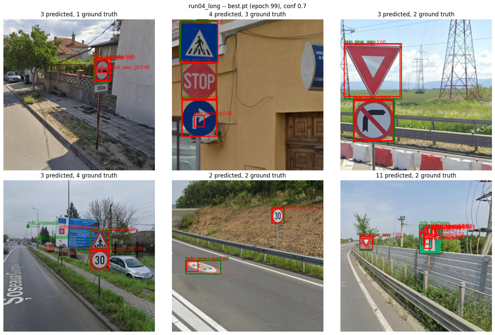

# yolo-edge-quantization

A YOLO-style object detector, built from scratch in PyTorch, trained on a real
traffic-sign dataset, then quantized and benchmarked for CPU/edge deployment.

**Status: in progress.** Current best: **val mAP@0.5 = 0.402**, trained from scratch
for 100 epochs (run04; up from 0.156 for the first working run -- see
[Results](#results)). Getting a first working model took fixing three bugs that kept
mAP at exactly 0 (see [Debugging the first runs](#debugging-the-first-runs)). Against
Ultralytics YOLOv8n trained from scratch under the same conditions it scores higher
(0.402 vs 0.284), but for an instructive reason: YOLOv8n localizes better, this model
classifies much better (see [Comparison with YOLOv8n](#comparison-with-yolov8n)).
Next: YOLOv8n fine-tuned from COCO weights, then quantization -- see
[Roadmap](#roadmap).

## Goal

The aim is to separate out, honestly, what each piece of a modern detector actually
buys you: the architecture itself, the training recipe, and pretraining. Building
the detector from scratch and comparing it against a reference implementation under
matched conditions is how this project tries to answer that:

1. **This repo's model**, trained from scratch.
2. **Ultralytics YOLOv8n**, trained from scratch on the same data.
3. **Ultralytics YOLOv8n**, fine-tuned from COCO-pretrained weights.

(1) vs (2) isolates how close a from-scratch reimplementation gets to a mature
reference architecture under identical conditions. (2) vs (3) isolates the value of
pretraining, which (1) can't replicate but can be measured against. The final
deliverable quantizes and benchmarks this repo's own model on CPU (PyTorch -> ONNX ->
ONNX Runtime, FP32 vs post-training-quantized INT8).

"Matched conditions" means matching what defines the task -- the data split, input
size (320), epoch budget, checkpoint selection on val, the scoring code, and anything
that changes what a label means (no horizontal flips: a mirrored "turn left" sign is
a "turn right" sign) -- while each model keeps its own training recipe and
post-processing, tuned on val. Final numbers come from the test split, used once.

## Architecture

Multi-class, multi-scale, anchor-free detector in the YOLOv8 family:

```
image --> Backbone --> P3, P4, P5 (strides 8/16/32)
                 \
                  --> Neck (FPN top-down + PAN bottom-up) --> 3 refined feature maps
                                  \
                                   --> Head x3 (one per scale) --> (box, obj, cls) per cell
```

- **Backbone**: stride-2 `Conv` + `C2f` blocks, channel-doubling on every downsample,
  topped with `SPPF`.
- **Neck**: upsample + concat + `C2f` (top-down), then downsample + concat + `C2f`
  (bottom-up) -- lets every scale see both fine detail and deep semantics.
- **Head**: per scale, a shared conv trunk splits into three branches -- box
  regression (4 channels, `(l,t,r,b)` distances from the cell center), objectness
  (1 channel), and classification (`num_classes` channels). Originally merged
  objectness into the class scores (YOLOv8's actual design), with focal loss to
  offset the resulting ~1:20,000 positive:negative cell ratio at train time; in
  practice this didn't converge within budget, so objectness was decoupled back out
  (YOLOv1-v5 style) -- classification loss is now computed only at positive cells,
  removing it from facing that imbalance at all, rather than just reweighting it.
  Caveat: the merged design was judged with an evaluation bug in place (bug 1 below),
  so it was never given a fair comparison.
- **Loss**: L1 box loss at positive cells; classification BCE summed over classes and
  normalized per positive cell; objectness BCE with positive and empty cells averaged
  separately. Both normalizations are fixes, explained in
  [Debugging the first runs](#debugging-the-first-runs).
- **Decode**: score = `sigmoid(obj) * max(sigmoid(cls))`, then per-class (or
  class-agnostic) NMS.
- **Target assignment**: FCOS-style static size-range routing (a box goes to the
  scale whose stride best matches its size), stride-normalized regression targets,
  smallest-box-wins on cell collisions, and center sampling: the cell containing the
  box center plus its neighbours whose centers fall inside the box are all positives
  (up to 9 per object, see [run03](results/run03_center/README.md)).

## Repo structure

```
models/    Conv, Bottleneck, C2f, SPPF, Backbone, Neck, Head, YOLO
train/     target assignment, loss, inference decode + NMS, mAP, training loop,
           per-branch diagnostics
data/      dataset-agnostic: COCO-format pooling/redistribution/manifest, Dataset,
           augmentation, export to Ultralytics' format (same split for the baselines)
colab/     dataset split, training (own model + YOLOv8n), debugging, and model
           comparison notebooks (the only place that knows this is Roboflow's
           traffic-sign dataset specifically -- everything above is dataset-agnostic)
results/   per-run metrics, logs and prediction images; the debugging and
           comparison write-ups
tests/     pytest, 131 tests, every module above
train_model.py, export_model.py, quantize_model.py, benchmark.py
           CLIs: training, ONNX export, INT8 quantization, CPU latency
```

## Dataset

[Roboflow: YOLO to COCO Traffic Signs](https://universe.roboflow.com/yolo-to-coco-ca2en/yolo-to-coco-kpv56) (54 classes,
~6,000 images). The provided train/valid/test split isn't class-stratified, so
`data/coco_split.py` redistributes it photo-by-photo, rarest class first, 70/15/15 --
keeping every class (forced train-only below a minimum-photo threshold) rather than
dropping rare ones outright. See `colab/dataset_split.ipynb` for the full diagnostic.

## Debugging the first runs

Every early run reported val mAP@0.5 = 0.0000 while all losses kept falling. Three
separate bugs were behind it. Each was found by measuring one branch of the head in
isolation (`train/diagnostics.py`, class-agnostic mAP), and each fix was confirmed by
an experiment where it was the only change. Full numbers and plots:
[results/debugging](results/debugging/README.md).

1. **The evaluation threshold hid real detections.** Predictions were filtered at
   confidence 0.3 before computing mAP, and early in training every true positive
   scored below that. At 0.001, the same checkpoint scored 0.005 mAP -- and **0.265
   class-agnostic mAP**: boxes were already good, classes weren't.
2. **The classification loss was scaled down 54x.** BCE averaged over (positive cells
   x 54 classes) gave the correct class 1/54 of a gradient. The classifier collapsed
   onto the most frequent class (59% of predictions for a class that's 12.5% of
   objects), equally on train and val. Normalizing per positive cell (as YOLOv8 does)
   took top-1 on a 64-image overfit test from 0.30 to 1.00.
3. **Objectness was drowned by empty cells.** One mean over ~2,100 cells per image,
   1-2 of them positive, pushed objectness to ~0 everywhere (median 0.002 at real
   objects). Averaging positive and empty cells separately took the overfit test's
   mAP from 0.26 to **0.97**.

Bugs 2 and 3 are the same mistake: averaging a loss over many elements when only a
few of them carry the signal.

## Results

This repo's model, trained from scratch: 320px input, same data split, scored with this
repo's own mAP code on the val split. Each run changes one thing from the one before;
its folder has the config, full log, prediction images and observations.

| run | change | epochs | best val mAP@0.5 | what it showed |
|---|---|---|---|---|
| [run01_baseline](results/run01_baseline/README.md) | -- | 50 | 0.156 | classification overfits from epoch 18; stacked duplicate boxes |
| [run02_augment](results/run02_augment/README.md) | + augmentation (no flips), AdamW, warmup + cosine LR | 50 | 0.254 | overfitting gone; val mAP still rising at the end |
| [run03_center](results/run03_center/README.md) | + center sampling | 50 | 0.293 | duplicate stacks gone: neighbouring cells now learn the right class and box |
| [run04_long](results/run04_long/README.md) | trained 2x longer | 100 | **0.402** | plateau at ~0.40; late overfitting shows up as boxes on pictograms inside signs |



*Run 4 on test images, conf 0.7. Green: ground truth. Red: predictions.*

For scale: a COCO-pretrained YOLOv8n fine-tuned on this dataset in an earlier
project reached 0.79 mAP@0.5 -- with pretraining, Ultralytics' default training
recipe (augmentation included) and a different split, so it's a ceiling, not a
like-for-like comparison. The fair comparison is YOLOv8n trained from scratch under
this repo's settings (see [Goal](#goal)) -- next section.

## Comparison with YOLOv8n

This repo's model (run04) vs. Ultralytics YOLOv8n trained from scratch, same split,
320px, 100 epochs, scored by the same code (`colab/compare_models.ipynb`). Val split
for now -- final numbers on test at the end. Full tables (recall by object size,
per-class AP, NMS sweep): [results/comparison](results/comparison/README.md).

| | own (run04) | YOLOv8n default recipe | YOLOv8n no flips + repeat-factor sampling |
|---|---|---|---|
| parameters / GFLOPs at 320 | 3.57M / 1.92 | 3.02M / 2.03 | 3.02M / 2.03 |
| **mAP@0.5** | **0.402** | 0.283 | 0.284 |
| class-agnostic mAP@0.5 | 0.678 | **0.769** | 0.759 |
| mAP lost to wrong classes | **0.276** | 0.486 | 0.475 |
| F1 at each model's best threshold | **0.626** | 0.575 | 0.594 |

What it shows:

- **Complementary strengths.** YOLOv8n finds and boxes objects better (class-agnostic
  mAP ~0.76 vs 0.68) -- its box loss (DFL + CIoU) and dynamic target assignment are
  stronger than this model's L1 distances and fixed size ranges. This model classifies
  far better, and that decides mAP@0.5 at 320px.
- **A hypothesis that didn't hold.** Against YOLOv8n's default recipe, the gap sat in
  rare classes (classes with < 20 training objects: 0.11 vs 0.01 mean AP) and in
  left/right signs (`mand_left`: 0.75 vs 0.00) -- pointing at the default's horizontal
  flips, which swap left/right signs' meaning, and its lack of class rebalancing.
  Training YOLOv8n again without flips and with the same repeat-factor sampling as this
  model changed almost nothing (mAP 0.283 -> 0.284).
- **Likely causes, not tested** (no further runs budgeted): mosaic augmentation at
  320px shrinks a median 29px sign to ~15px for most of training -- enough to locate,
  often not enough to read "30" vs "50" or an arrow's direction -- and Ultralytics'
  loss weighting favours boxes over classes (7.5 + 1.5 vs 0.5).
- **Caveats:** val split (this model's recipe was tuned on it), one run per model,
  letterbox vs. stretch resizing not isolated.

## Usage

```
pip install -r requirements.txt
python -m pytest tests/

# manifest.json: built by data/coco_split.py (see colab/train_own_model.ipynb)
python train_model.py --manifest manifest.json --out-dir runs/own --num-classes 54 --epochs 100
python export_model.py --checkpoint runs/own/best.pt --num-classes 54 --out model_fp32.onnx
python quantize_model.py --onnx model_fp32.onnx --out model_int8.onnx --manifest manifest.json
python benchmark.py fp32=model_fp32.onnx int8=model_int8.onnx --threads 1 2 4
```

Training ran on Colab: `colab/train_own_model.ipynb` for this model,
`colab/train_yolov8n.ipynb` for the baselines, `colab/quantize_own_model.ipynb` for the
INT8 model. `colab/compare_models.ipynb` evaluates them all, on the same images.

## Roadmap

- [x] Architecture (backbone, neck, head), fully tested
- [x] Target assignment, loss, inference decode + NMS, mAP, training loop
- [x] Dataset pooling/redistribution/manifest, verified against real data
- [x] Repeat-factor sampling (class imbalance is still severe even after the
      stratified split -- this is a training-time fix, not a splitting one)
- [x] ONNX export with a PyTorch-parity check
- [x] Per-branch diagnostics; fixed eval threshold, cls and obj loss normalization
- [x] A real training run (baseline: val mAP@0.5 0.156)
- [x] Augmentation (box-aware, no horizontal flips) + LR schedule (val mAP@0.5 0.254)
- [x] Center sampling (several positive cells per object) (val mAP@0.5 0.293)
- [x] Long final training run with the settled recipe (100 epochs, val mAP@0.5 0.402)
- [x] Comparison tooling: per-class AP vs. training examples, class-agnostic mAP,
      recall by size, confusions, per-model NMS/threshold tuning
- [x] YOLOv8n from scratch (default recipe, then no flips + repeat-factor sampling)
- [ ] YOLOv8n fine-tuned from COCO weights
- [ ] Three-way comparison on the test split
- [x] Post-training INT8 quantization + CPU latency tooling
- [ ] Quantization results

## License

[MIT](LICENSE) for this repo's code. The YOLOv8n baselines are trained with
[Ultralytics](https://github.com/ultralytics/ultralytics) as a separate dependency,
under its own AGPL-3.0 license; none of its code or weights are included here.
